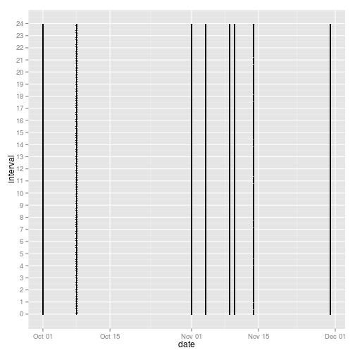

## Loading and preprocessing the data

```r
library(ggplot2)
library(reshape2)
library(scales)  # For date_format

T <- read.csv("activity.csv")
T$date <- as.Date(T$date)
wd <- weekdays(x = T$date, abbreviate = TRUE)
we <- wd %in% c('Sat', 'Sun')
T$daytype <- factor(we, levels=c("TRUE", "FALSE"), label=c("weekend", "weekday"))
T$interval <- floor(T$interval/100) * 60 + T$interval %% 100
hours <- seq(from = 0, to = 24, by = 1)
hoursLabel <- sapply(X = hours, FUN=as.character)
hoursInMinutes <- seq(from = 0, to = 24 * 60, by = 60)
```


## What is mean total number of steps taken per day?
Here is a histogram of the total number of steps taken each day:


```r
melted <- melt(data=T, na.rm=TRUE, id.vars=c("date", "interval"), measure.vars=c("steps"))
counted <- dcast(data=melted, date ~ variable, fun.aggregate=sum)
counted$month <- format(x = as.Date(counted$date), format = "%m")
counted$day <- format(x = as.Date(counted$date), format = "%d")
g <- ggplot(counted)
g + geom_bar(aes(x=date, y=steps, fill=steps, color=month), stat="identity") +
    scale_x_date(breaks="1 day", labels=date_format("%d")) +
    xlab(label = "Day") + ylab(label = "Steps") +
    labs(title = "Total number of steps taken each day from 2012 Oct. to 2012 Nov.")
```

 

Mean total number of steps over dates:

```r
mean(counted$steps, na.rm = TRUE)
```

```
## [1] 10766
```

```r
median(counted$steps, na.rm = TRUE)
```

```
## [1] 10765
```


## What is the average daily activity pattern?
Here is a time series plot (i.e. type = "l") of the 5-minute interval (x-axis) and the average number of steps taken, averaged across all days (y-axis)

```r
counted <- dcast(data=melted, interval ~ variable, fun.aggregate=mean)
g <- ggplot(counted)
g + geom_line(aes(x=interval, y=steps), stat="identity") +
    xlab(label = "Time in Hour (0-23)") + ylab(label = "Steps") +
    labs(title = "Time series plot of the 5-minute interval and the average number of steps") +
    scale_x_continuous(breaks=hoursInMinutes, label=hoursLabel)
```

 

The maximum average number of steps over all intervals is found as

```r
counted[which.max(counted$steps),]
```

```
##     interval steps
## 104      515 206.2
```

## Imputing missing values
1. Here is the total number of missing values in the dataset:

```r
sum(is.na(T$steps))
```

```
## [1] 2304
```

2. Let us see whether any tendency of missing values exists by plotting the date on x-axis and the interval on the y axis.


```r
missingT <- T[is.na(T$steps),]
g <- ggplot(missingT)
g + geom_point(aes(x=date, y=interval), size=1) +
    scale_y_continuous(breaks=hoursInMinutes, label=hoursLabel)
```

 

From the plot, there are clear tendencies:

* missing values reside only on certain days but not uniformely distributed.
* the entire data on those days are missing.

Those missing days are


```r
missingDates <- as.vector(levels(as.factor((T[is.na(T$steps),"date"]))))
missingDates
```

```
## [1] "2012-10-01" "2012-10-08" "2012-11-01" "2012-11-04" "2012-11-09"
## [6] "2012-11-10" "2012-11-14" "2012-11-30"
```

To replace the date on the missing dates, let us take some average looking date as October 11th and fill in this data entirely into the missing dates.


```r
for(d in missingDates){
    T[T$date == d, "steps"] <- T[T$date == "2012-10-11", "steps"]
}
```

Here is the same histogram but with the new data set.


```r
melted <- melt(data=T, na.rm=TRUE, id.vars=c("date", "interval"), measure.vars=c("steps"))
counted <- dcast(data=melted, date ~ variable, fun.aggregate=sum)
counted$month <- format(x = as.Date(counted$date), format = "%m")
counted$day <- format(x = as.Date(counted$date), format = "%d")
g <- ggplot(counted)
g + geom_bar(aes(x=date, y=steps, fill=steps, color=month), stat="identity") +
    scale_x_date(breaks="1 day", labels=date_format("%d")) +
    xlab(label = "Day") + ylab(label = "Steps") +
    labs(title = "Total number of steps taken each day from 2012 Oct. to 2012 Nov.")
```

 

Now we can see there are no missing dates. Let us now calculate the mean total number of steps over dates:


```r
mean(counted$steps, na.rm = TRUE)
```

```
## [1] 10706
```

```r
median(counted$steps, na.rm = TRUE)
```

```
## [1] 10395
```

We can see that the mean did not change by inserting average data but the median changed slightly.

## Are there differences in activity patterns between weekdays and weekends?

Here's the plots to see whether differences exist between weekdays and weekends.


```r
melted <- melt(data=T, na.rm=TRUE, id.vars=c("date", "interval", "daytype"), measure.vars=c("steps"))
counted <- dcast(data=melted, interval + daytype ~ variable, fun.aggregate=mean)
g <- ggplot(counted)
g + geom_line(aes(x=interval, y=steps, color=daytype), stat="identity") +
    xlab(label = "Time in Hour (0-23)") + ylab(label = "Steps") +
    facet_grid(daytype ~ .) +
    labs(title = "Time series plot of the 5-minute interval and the average number of steps") +
    scale_x_continuous(breaks=hoursInMinutes, label=hoursLabel)
```

 

From this plot, it is easy to see there are some differences.

* Activity tends to start earlier on weekdays.
* During the day time, activity seem a little bit higher on weeekend.
* Activity tends to end earllier on weekdays.
